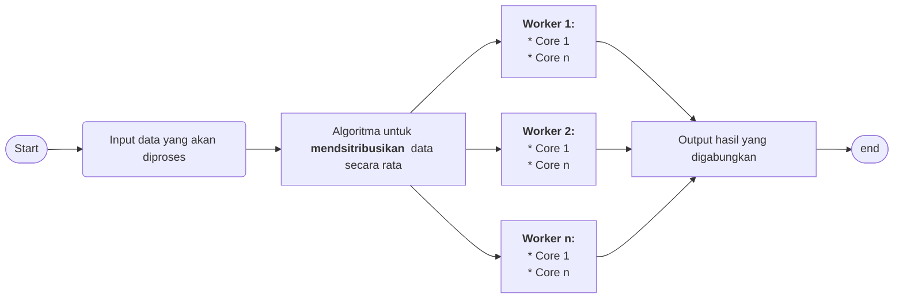

# Implementasi Komputasi Paralel dan Sistem Terdistribusi untuk Memproses Perhitungan Matematika Iteratif

Program untuk memproses perhitungan matematika yang bersifat iteratif, seperti faktorial ($3! = 3 * 2 * 1$), baris dan deret (deret bilangan fibbonaci = $0, 1, 1, 2, ((n - 1) + (n - 2)), ...$), perkalian matriks, atau perhitungan matematika lainnya yang memerlukan perulangan (*looping*). Dibuat untuk memenuhi tugas Final Project - Komputasi Paralel dan Terdistribusi 2025/2026.

## Latar Belakang
Perhitungan matematika iteratif memerlukan perulangan (*looping*) untuk mendapatkan hasil (output). Jika proses *looping* dilakukan secara sekuensial (berurutan satu-persatu) akan memerlukan waktu yang lama. Selain itu, jika input perhitungan (data yang akan diproses) berjumlah besar maka akan menggunakan sumber daya dalam jumlah yang banyak ('memakan' *memory* dan *processor*). Dengan menggunakan komputasi paralel, proses perhitungan bisa dilakukan secara bersamaan (*concurrent*) menggunakan beberapa *threads/cores* sekaligus, sehingga waktu yang pemrosesan bisa lebih cepat. Untuk masalah sumber daya, proses perhitungan juga bisa dibagi ke beberapa komputer/*worker* (menggunakan *virtual machine/docker container*), sehingga sumber daya yang digunakan tidak dibebankan pada 1 *worker* saja. Nantinya, hasil akhir dari masing-masing *worker* dapat disatukan kembali.

### Konsep yang digunakan
1. Komputasi Terdistribusi (*parallel computing*): memproses secara bersamaan menggunakan beberapa *threads/cores* sekaligus
2. Sistem Terdistribusi (*distributed system*): membagi data yang akan diproses ke beberapa komputer (*worker*)

### Skema kasar 

1. Melakukan input data yang ingin diproses. `contoh: input data angka 1 sampai 1.000.000.000 (satu miliar)`
2. Membagi (mendsitribusikan) data secara rata ke beberapa *worker*. `contoh: jika ada 2 worker, maka worker1 akan mendapatkan angka 1 - 500.000.000 (lima ratus ribu), sedangkan worker2 akan mendapatkan angka 500.000.001 (lima ratus ribu satu) - 1.000.000.000 (satu miliar)`
3. *Worker* memproses data secara palalel menggunakan beberapa *threads/cores* sekaligus: `contoh: worker melakukan penjumlahan akar (square root) dari 1 sampai 1.000.000.000 (satu miliar) menggunakan beberapa threads/cores`
4. Menggabungkan kembali hasil yang ada pada seluruh *worker*: `contoh: hasil perhitungan pada masing-masing worker digabung menjadi satu`

## Kontributor
1. Khairullah (2430306030012)
2. Hadi Setiawan (2430205030016)
3. Jona Surya Mapau (2430305030026)
4. Bintang Saputra Kahaya (2430205030033)
5. Ahmad Amin Badani (2430205030017)