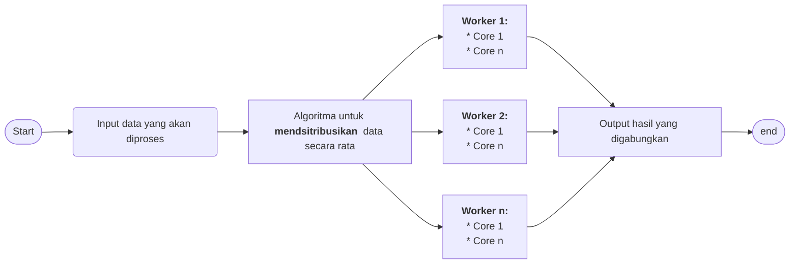

# Implementasi Komputasi Paralel dan Sistem Terdistribusi untuk Penjumlahan Bilangan Akar

Program untuk menghitung penjumlahan akar (*square root*) dari 1 sampai *n* menggunakan komputasi paralel dan sistem terdistribusi. Dibuat untuk memenuhi tugas Final Project - Komputasi Paralel dan Terdistribusi 2025/2026.

### Konsep yang digunakan
1. Komputasi Terdistribusi (*parallel computing*): memproses secara bersamaan menggunakan beberapa *threads/cores* sekaligus
2. Sistem Terdistribusi (*distributed system*): membagi data yang akan diproses ke beberapa *worker*

### Skema kasar 

```mermaid
flowchart LR
  A([Start]) --> B(Input data yang akan diproses)
  B --> C["`Algoritma untuk **mendsitribusikan**  data secara rata`"] 
  C --> 
    D["`**Worker 1:** 
    * Core 1
    * Core n`"] & E["`**Worker 2:** 
    * Core 1
    * Core n`"] & F["`**Worker n:** 
    * Core 1
    * Core n`"]
  D & E & F --> G[Output hasil yang digabungkan] 
  G --> Z([end])
```

1. Melakukan input data yang ingin diproses. `contoh: input data angka 1 sampai 1.000.000.000 (satu miliar)`
2. Membagi (mendsitribusikan) data secara rata ke beberapa *worker*. `contoh: jika ada 2 worker, maka worker1 akan mendapatkan angka 1 - 500.000.000 (lima ratus ribu), sedangkan worker2 akan mendapatkan angka 500.000.001 (lima ratus ribu satu) - 1.000.000.000 (satu miliar)`
3. *Worker* memproses data secara palalel menggunakan beberapa *threads/cores* sekaligus: `contoh: worker melakukan penjumlahan akar (square root) dari 1 sampai 1.000.000.000 (satu miliar) menggunakan beberapa threads/cores`
4. Menggabungkan kembali hasil yang ada pada seluruh *worker*: `contoh: hasil perhitungan pada masing-masing worker digabung menjadi satu`

## Development
### Untuk menjalankan project menggunakan Docker:
* Jalankan container: `docker compose up -d --build`
* Periksa container: `docker ps -a`
* Masuk ke dalam container Ubuntu: `docker exec -it mpi_master /bin/bash`
* Berhentikan container: `docker compose down`
### Untuk menjalankan project menggunakan Podman:
* Jalankan container: `podman-compose up -d --build`
* Periksa container: `podman ps -a`
* Masuk ke dalam container Ubuntu: `podman exec -it mpi_master /bin/bash`
* Berhentikan container: `podman-compose down`

## Kontributor
1. Khairullah (2430306030012)
2. Hadi Setiawan (2430205030016)
3. Jona Surya Mapau (2430305030026)
4. Bintang Saputra Kahaya (2430205030033)
5. Ahmad Amin Badani (2430205030017)