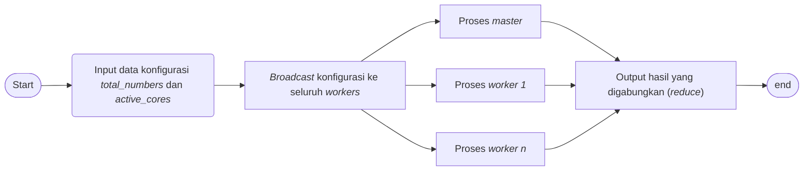

# Laporan akhir: [Laporan akhir - versi Docker Container](public/laporan-akhir-docker-container.pdf)

# Implementasi Komputasi Paralel dan Sistem Terdistribusi untuk Penjumlahan Bilangan Akar

Program untuk menghitung penjumlahan akar (*square root*) dari 1 sampai *n* menggunakan komputasi paralel (`OpenMP`) dan sistem terdistribusi (`OpenMPI`). Dibuat untuk memenuhi tugas Final Project - Komputasi Paralel dan Terdistribusi 2025/2026.

### Konsep yang digunakan
1. Komputasi Terdistribusi (*parallel computing*): memproses secara bersamaan menggunakan beberapa *threads/cores* sekaligus
2. Sistem Terdistribusi (*distributed system*): membagikan data ke beberapa *workers*

### Skema kasar 

```mermaid
flowchart LR
  A([Start]) --> B("`Input data konfigurasi *total_numbers* dan *active_cores*`")
  B --> C["`*Broadcast* konfigurasi ke seluruh *workers*`"] 
  C --> 
    D["`Proses *master*`"] & E["`Proses *worker 1*`"] & F["`Proses *worker n*`"]
  D & E & F --> G["`Output hasil yang digabungkan (*reduce*)`"] 
  G --> Z([end])
```

1. Melakukan input data (berupa `total_numbers` dan `active_cores`)
    * `total_numbers = 1.000.000.000 (satu miliar)`
    * `active_cores = 4`
2. Mem-*broadcast* (mengirimkan/menyiarkan konfigurasi) data ke seluruh *workers*
    * misal terdapat 1 master (`master`) dan 1 workers (`worker1`)
3. *Worker* memproses data pada *range* tertentu berdasarkan `rank`-nya secara palalel menggunakan beberapa *threads/cores* 
    * `master: start = 1; end = 5.000.000`
    * `worker1: start = 5.000.001; end = 1.000.000.000`
    * masing-masing *workers* `#pragma omp parallel for num_threads(active_cores) (i = start; i < end; i++)`
4. Menggabungkan kembali seluruh hasil: 
    * menggunakan `MPI_Reduce()`

## Development
### Docker:
* Jalankan container: `docker compose up -d --build`
* Periksa container: `docker ps -a`
* Masuk ke dalam container Ubuntu: `docker exec -it mpi_master /bin/bash`
* Berhentikan container: `docker compose down`
### Podman:
* Jalankan container: `podman-compose up -d --build`
* Periksa container: `podman ps -a`
* Masuk ke dalam container Ubuntu: `podman exec -it mpi_master /bin/bash`
* Berhentikan container: `podman-compose down`
### Run
* Compile program: `make`
* Test program: `bin/test`
* Run program: `mpirun --host mpi-master,mpi-worker1,mpi-worker2 --map-by node --bind-to none -n 3 bin/main`
  * Ubah `-n 3` menjadi `-n 2` atau `-n 1` untuk konfigurasi 2 atau 1 *worker*
  * Tambahkan *argument* `100000000 4` di bagian akhir untuk konfigurasi `total_numbers` dan `active_cores`. 
    * `mpirun --host mpi-master,mpi-worker1,mpi-worker2 --map-by node --bind-to none -n 3 bin/main 1000000000 4`
    * `mpirun --host mpi-master,mpi-worker1,mpi-worker2 --map-by node --bind-to none -n 3 bin/main 5000000000 8`

## Kontributor
1. Khairullah (2430306030012)
2. Hadi Setiawan (2430205030016)
3. Jona Surya Mapau (2430305030026)
4. Bintang Saputra Kahaya (2430205030033)
5. Ahmad Amin Badani (2430205030017)